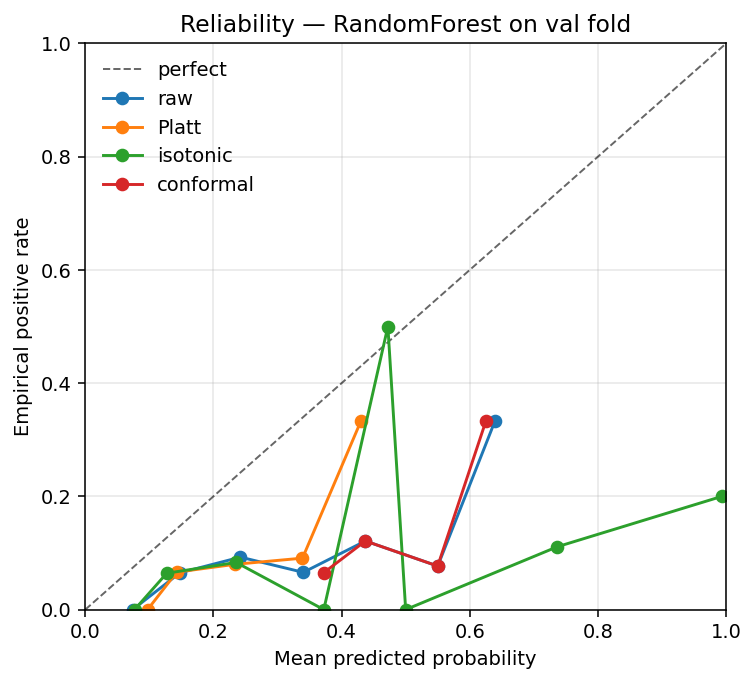
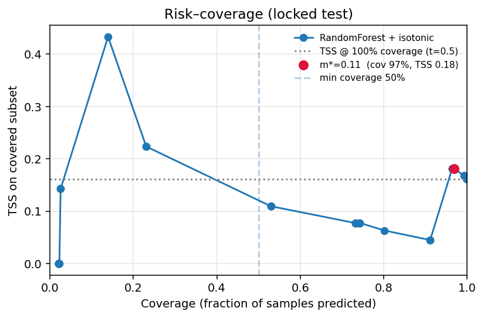

# helioguard

**Calibrated Space-Weather Risk Scoring for Satellite Anomalies**

Author: Nikola Kolev
Course: Machine Learning, SoftUni 2026

---

## Research question

Solar storms drive a measurable fraction of geostationary spacecraft
anomalies through surface charging (ESD), internal / deep-dielectric
charging (ECEMP), and single-event upsets from energetic particles
(SEU). The published literature has fused NASA's OMNI database with
operational outage records (Figueroa et al. 2025; Rodriguez et al.
2025) but rarely with the methodological discipline that decision
support actually requires: well-calibrated probabilities, an explicit
abstention option for low-confidence inputs, and a chronological
evaluation protocol with no leakage.

This project answers a single, falsifiable question:

> Given the solar-wind and geomagnetic state of the preceding hours,
> can a machine-learning model output **calibrated** probabilities of
> a next-day satellite anomaly, and does **selective prediction**
> (abstaining on low-confidence inputs) recover materially better
> operating performance on the confident subset?

The answer may be *no*. A project that demonstrates a calibrated null
result on real public data is scientifically more honest than one that
data-mines until it finds a flattering ROC curve.

## Hypotheses (stated before any model was trained)

| ID  | Hypothesis | Test | Test fold |
|-----|------------|------|-----------|
| H₁  | Southward IMF $B_z$ with elevated solar-wind speed raises next-day anomaly odds | Logistic regression coefficients + likelihood-ratio test against intercept-only | train |
| H₂  | ESD anomalies cluster on storm main phase; ECEMP on recovery phase | $\chi^2$ test of independence on (storm phase $\times$ diagnosis) | train |
| H₃  | A small unsupervised regime set adds information beyond Kp alone | Likelihood-ratio test of K-means cluster dummies added to a Kp-only logit | train |

H₃ is phrased deliberately as *no additive linear improvement*, not
*statistical independence*. A non-significant LR test means clusters
carry no linear contribution beyond Kp; it does **not** mean clusters
and the label are independent — the Pearson-$\approx 0$-vs-independence
trap flagged in my Data Science exam critique.

## Data sources

This project uses **two genuinely independent public sources**, joined
at daily resolution:

| Source | Type | Provider | Coverage | Size |
|--------|------|----------|----------|------|
| OMNI2 hourly solar wind, IMF, Kp, Dst, F10.7, AE | Numerical time series | NASA SPDF | 1974–1994 (project window) | ≈ 60 MB |
| NCEI Spacecraft Anomalies (`anom5j.xls`) | Event catalogue | NOAA NCEI | 1963–1994 (5 033 events) | ≈ 2.6 MB |

**Locked test set.** Days 1992-01-01 to 1994-09-11 are held out before
any analysis. They are touched exactly once, in §10 of the notebook.

**Final dataset.** 5 844 train days, 730 validation days, 985 locked
test days. Daily binary target `any_environmental` = at least one
catalogued ESD, ECEMP, or SEU event on that day.

## Project structure

```
helioguard/
│
├── notebooks/
│   ├── helioguard.ipynb        ← main report — narrative + math + figures
│   └── 00_data_audit.ipynb     ← earlier audit notebook, kept for provenance
│
├── src/helioguard/             ← all analysis logic (notebook orchestrates only)
│   ├── config.py               ← paths, OMNI column spec, fill values, seed
│   ├── data/
│   │   ├── download.py         ← idempotent OMNI + NCEI downloaders
│   │   ├── omni.py             ← OMNI fixed-width parser, fill-value handling, Kp/10 decoding
│   │   └── ncei.py             ← NCEI .xls parser, ADATE-not-EDATE fix, daily aggregator
│   ├── features.py             ← leakage-safe lag / rolling / storm-phase / cyclic-DOY pipeline
│   ├── metrics.py              ← TSS, HSS, Brier, ECE, reliability bins, risk-coverage curve
│   ├── plots.py                ← reliability diagram, risk-coverage plot
│   └── tracking.py             ← MLflow (SQLite backend) setup helper
│
├── scripts/
│   ├── build_notebook.py       ← regenerates notebooks/helioguard.ipynb deterministically
│   └── build_notebook_00.py    ← regenerates the audit notebook
│
├── data/
│   ├── raw/                    ← gitignored, DVC-tracked: OMNI .dat + NCEI .xls
│   ├── interim/                ← parsed but not yet aligned
│   └── processed/              ← daily fused panel ready for modelling
│
├── tests/                      ← pytest, 9 parser + label sanity checks
│   └── test_parsers.py
│
├── docs/
│   └── serving.md              ← how to load the joblib pipeline and score new days
│
├── Makefile                    ← `make data | test | mlflow-ui | clean`
├── requirements.txt
└── README.md
```

## How to reproduce the analysis

```bash
# 1. Clone the repo
git clone https://github.com/niki7o/HelioGuard.git
cd HelioGuard

# 2. Install dependencies
python -m venv .venv && . .venv/bin/activate
pip install -r requirements.txt

# 3. Download the raw data (idempotent, ≈ 60 MB)
python -m helioguard.data.download

# 4. Regenerate the notebook from its build script and execute it
python scripts/build_notebook.py
PYTHONPATH=src python -m nbconvert --to notebook --execute --inplace \
    notebooks/helioguard.ipynb --ExecutePreprocessor.timeout=1200

# 5. (Optional) Run the test suite
PYTHONPATH=src python -m pytest tests/ -v

# 6. (Optional) Launch the MLflow UI
mlflow ui --backend-store-uri sqlite:///mlruns/mlflow.db --port 5000

# 7. (Optional) Launch the interactive demo
streamlit run src/helioguard/app/streamlit_app.py
```

The Streamlit app loads the saved pipeline and returns a calibrated
next-day anomaly probability for either a historical date (rigorous,
rebuilds the real feature vector) or a what-if slider scenario. It
shows the probability, the confidence margin, and the abstain/alert
decision using the same abstention threshold selected in §10 of the
notebook.

Total runtime end-to-end is under five minutes on a modern laptop
(dominated by the model fits and the Isomap projection).

## Methods

| Stage | Method |
|-------|--------|
| Time index | UTC; OMNI hourly resampled to daily for the label join |
| Splits | Chronological train / val / test, locked test set untouched until §10 |
| Features | Lags at 1, 3, 6, 24 h and rolling mean+std over 6, 24 h windows on $B_z$, $v_{sw}$, $n_p$, $p_{dyn}$, Dst, AE, F10.7, ap; storm-phase dummies from Dst; cyclic day-of-year. Imputer + scaler fitted **on the train fold only**. |
| Regression block | OLS, Ridge, Lasso, ElasticNet, Polynomial+Ridge, RANSAC on a daily-min-Dst target (in the spirit of Burton 1975) |
| Classification block | Persistence and climatology baselines; calibrated logistic regression; SVM (RBF), Random Forest, Gradient Boosting compared by chronological 5-fold TimeSeriesSplit ROC-AUC and validation TSS |
| Unsupervised | PCA(3) + Isomap(2); K-means++, Agglomerative-Ward, DBSCAN compared by silhouette and pos-rate spread |
| Calibration | Platt scaling, isotonic regression, split conformal — reliability diagram, Brier, ECE |
| Selective prediction | $\lvert p - 0.5 \rvert$ confidence margin swept to produce a risk–coverage curve on the locked test fold |
| Tracking | MLflow with SQLite backend; final pipeline serialised with joblib |

## Key results

The task is a genuine **next-day** forecast: features from the
solar-wind state up to the end of day *T* predict whether day *T+1*
has an environmental anomaly.

**Locked 1992–1994 test fold (default threshold 0.5):**

| Model | TSS | ROC-AUC | Brier | ECE |
|-------|-----|---------|-------|-----|
| persistence | **0.374** | — | 0.093 | 0.093 |
| climatology | 0.000 | 0.500 | 0.086 | 0.108 |
| RandomForest + isotonic | 0.161 | **0.682** | 0.106 | 0.129 |

**Accuracy is a trap, and the tuned threshold does not transfer** —
same model, three operating points on the locked test fold:

| Operating point | Accuracy | Recall | Precision | TSS |
|-----------------|----------|--------|-----------|-----|
| threshold 0.5 | 87.8 % | 22.5 % | 23.7 % | 0.161 |
| tuned t\* = 0.12 (val-selected) | 27.1 % | 88.8 % | 9.1 % | 0.104 |
| always "no anomaly" | 91.9 % | 0.0 % | 0.0 % | 0.000 |

The headline findings:

1. **Accuracy is meaningless here.** A model that never alerts scores
   91.9 % accuracy — higher than the trained model. Accuracy is
   maximised by doing nothing, so it is the wrong objective.
2. **Threshold tuning overfits validation.** Lowering the threshold to
   the validation-optimal t\* = 0.12 buys very high recall (89 %) but,
   out-of-sample on test, its TSS (0.104) does *not* beat the plain 0.5
   threshold (0.161). With a weak signal even a single scalar can fail
   to generalise, so 0.5 is kept as the headline and t\* is reported as
   a recall-oriented alternative, not an improvement.
3. **The model ranks weakly but honestly** (ROC-AUC 0.682 vs 0.5
   random) and its probabilities are calibrated (ECE drops from ~0.14
   raw to ~0.10 after Platt/isotonic). **Persistence (TSS 0.374) beats
   it** because anomaly days cluster temporally — but persistence cannot
   produce a probability or abstain, which the calibrated model can.

This modest result — below persistence on raw skill, but calibrated and
honest — *is* the contribution: OMNI-only daily inputs support
calibrated next-day probabilities, not a high-skill forecast. See §12
of the notebook for the full "honest null" discussion.

### Figures

| Calibration (validation fold) | Risk–coverage (locked test fold) |
|---|---|
|  |  |

The reliability diagram (left) compares the raw model output against
Platt, isotonic, and split-conformal recalibration — the closer to the
diagonal, the better calibrated. The risk–coverage curve (right) shows
TSS on the covered subset as the abstention margin is swept; the red
marker is the data-selected operating point $m^\*$. The curve is nearly
flat, which is the honest reading: selective prediction recovers little
on OMNI-only inputs at daily resolution.

## References

1. Bloomfield, D. S. et al. (2012). Toward Reliable Benchmarking of Solar Flare Forecasting Methods. *Astrophysical Journal Letters*, 747, L41.
2. Burton, R. K., McPherron, R. L., & Russell, C. T. (1975). An empirical relationship between interplanetary conditions and Dst. *Journal of Geophysical Research*, 80(31), 4204–4214.
3. Camporeale, E., & Berger, T. (2025). The Status and Future of Operational Space Weather Forecasting. *Space Weather*, 23.
4. Figueroa Herrera Acevedo, M., & Sierra Porta, D. (2025). Geomagnetic disturbances and grid vulnerability. *PLOS ONE*, 20(7), e0327716. doi:10.1371/journal.pone.0327716
5. Rodriguez, J. et al. (2025). Solar Wind and Magnetospheric Conditions for Satellite Anomalies Attributed to Shallow Internal Charging. *Space Weather*, 23. doi:10.1029/2024SW004112
6. Angryk, R. et al. (2020). Multivariate time series dataset for space weather data analytics. *Scientific Data*, 7, 227.
7. Vovk, V., Gammerman, A., & Shafer, G. (2005). *Algorithmic Learning in a Random World*. Springer. — split conformal prediction.
8. NASA OMNI documentation: https://omniweb.gsfc.nasa.gov/html/ow_data.html
9. NOAA NCEI Spacecraft Anomalies: https://www.ngdc.noaa.gov/stp/space-weather/satellite-data/

## License

MIT. Raw data is U.S. Government public domain (NASA / NOAA).
